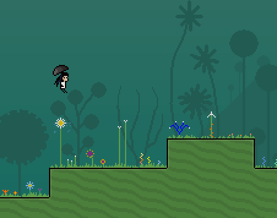
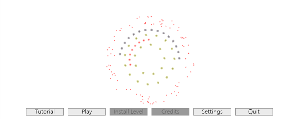
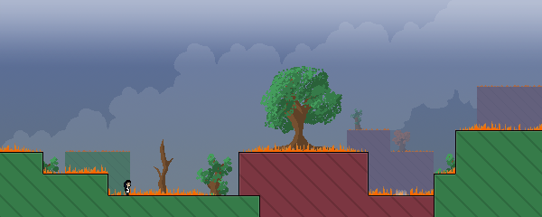
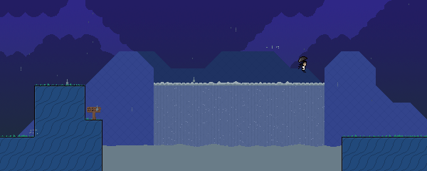
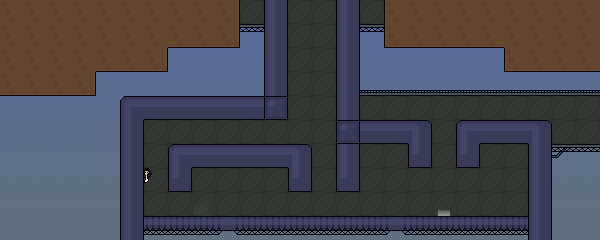
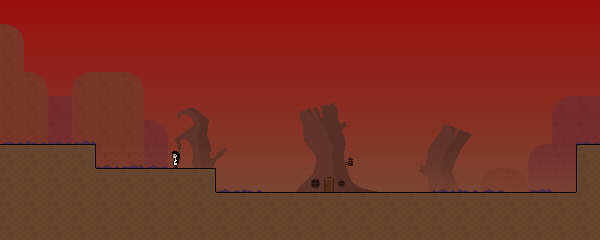

## YKnytt

An open source implementation of Knytt Stories in C# using Godot Engine

### Screenshots

### Building

Requires Godot 3.2.3.stable.mono

#### Export settings

To properly export, "*.raw, knytt/worlds/*" must be included in the export filters

### Playing

There must be a worlds directory in the project root (or next to the binary if you have exported).

Place unpacked worlds in that directory.

