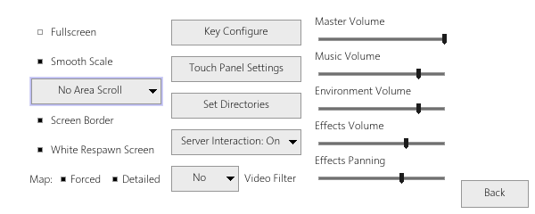
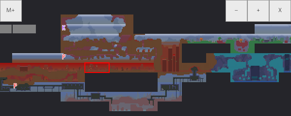
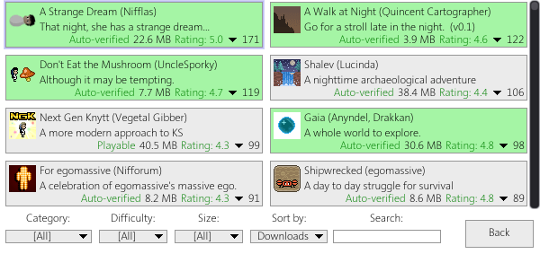

## YKnytt


An open source implementation of Knytt Stories in C# using Godot Engine

[Download YKnytt v0.7.0 for Android](https://github.com/youkaicountry/yknytt/releases/download/0.7.0/YKnytt_v0.7.0.apk)

[Download YKnytt v0.7.0 for Windows](https://github.com/youkaicountry/yknytt/releases/download/0.7.0/YKnytt_v0.7.0_win.zip)

[Download YKnytt v0.7.0 for Linux](https://github.com/youkaicountry/yknytt/releases/download/0.7.0/YKnytt_v0.7.0_linux.zip)

[Download YKnytt v0.7.0 for Linux ARM64 handhelds](https://github.com/youkaicountry/yknytt/releases/download/0.7.0/YKnytt_v0.7.0_linux_arm64_handhelds.zip)

[Download YKnytt v0.7.0 for macOS](https://github.com/youkaicountry/yknytt/releases/download/0.7.0/YKnytt_v0.7.0_macos.zip)

[Web version: play YKnytt v0.7.0 on itch.io](https://youkaicountry.itch.io/yknytt)

### Screenshots








### Reporting a broken level

If you find a bug in a level, just press "complain" on a level info screen. Your latest save will be sent to the server. There is no need to report it in issues, unless it requires some explanation. Results may appear [here](https://github.com/youkaicountry/yknytt/issues/200).

### Working directory

/Users/{user}/AppData/Roaming/YKnytt/ for Windows, ~/.local/share/YKnytt/ for Linux

### Custom data directory and portable installation

You can specify a custom data directory using the `--data` command line parameter:

```
YKnytt --data /path/to/custom/data
```

For portable installations (e.g., running from a USB drive), you can use a relative path:

```
YKnytt --data ./yknytt-data
```

This will store all game data (saves, downloaded worlds, cache, and settings) in the specified directory instead of the default user data directory.

### Building

Requires Godot 3.6.1.stable.mono and .NET Framework 4.8 Developer Pack for Windows (or mono-devel for Linux)

#### Export settings

To properly export, `knytt/worlds/*` must be included in the export filters

To build a proper Android APK, activate the "Internet" permission.
